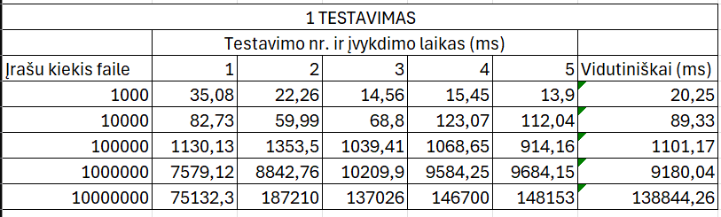

# objprog

APRAŠYMAS:

Ši programa generuoja studentų duomenų failus su skirtingais įrašų dydžiai, vėliau juos išskirsto pagal jų galutinį balą į dvi grupes: kietekų(galutinis balas >=5.0 ) ir vargšų(galutinis balas < 5.0). Testavimai buvo atlikti su  penkiais atsitiktinias studentų sąrašų failais, sudarytus iš: 1 000, 10 000, 100 000, 1 000 000, 10 000 000 įrašų. 

1 TYRIMAS: FAILŲ GENERAVIMO LAIKAS

Buvo išmatuotas laikas, per kurį sugeneruojami nauji studentų sąrašų failai su atitinkamais dydžiais.

2 TYRIMAS: DUOMENŲ APDOROJIMO LAIKAS

Buvo išmatuotas duomenų nuskaitymo iš egzistuojančio failo, studentų rikiavimo, rūšiavimo į dvi grupes bei rezultatų išvedimo į naujus failus sparta.